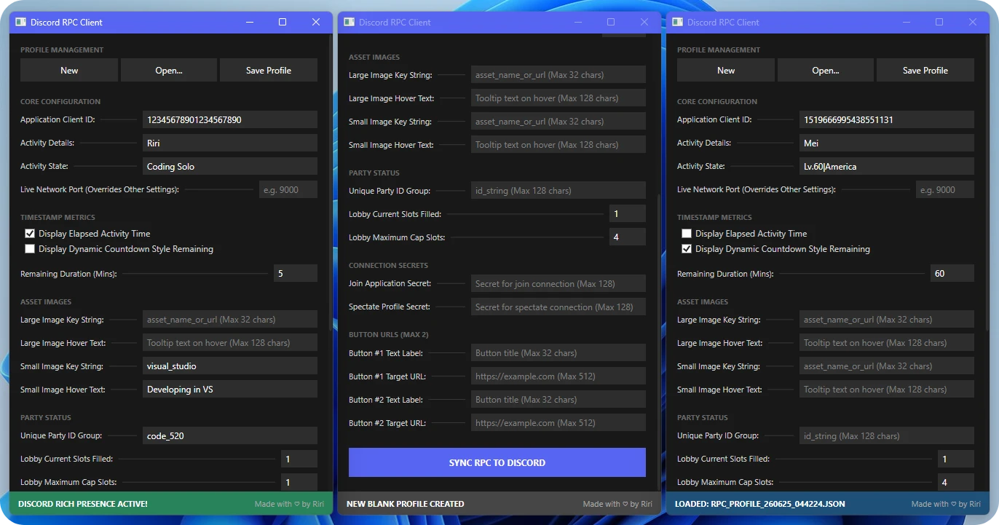

<div align="center">
  <h1>Discord RPC Client</h1>
</div>

<div align="center">

[](LICENSE)
[](#)
[](#)
[](#)
[](#)


A fully free, open-source, and unopinionated Discord Custom Rich Presence editor.

  
</div>

---

## 🛠️ Yet Another RPC Client‽

Here is what makes this client different:

* Open Source (No Black Boxes)
* No Forced Advertisements
* Complete Field Support
* Exportable/Importable Config
* A Real GUI (No Plaintext Editing)
* UDP Payload Support for Values
* The App is Just a Couple Hundred Kilobytes

---

## ⚙️ Technical Specification

The client is built on the [.NET 10](https://dotnet.microsoft.com/en-us/download/dotnet/10.0) framework (C#) with WPF and is powered by [DiscordRichPresence](https://www.nuget.org/packages/DiscordRichPresence) by [Lachee](https://www.nuget.org/profiles/Lachee).

<details>
  <summary>UDP payload schema</summary>

```
{
  "ClientId": "1234567890123456",
  "Details": "Exploring the Dungeon",
  "State": "In a Party",
  "UseTimestamps": true,
  "AsTimeRemaining": true,
  "TotalDurationMinutes": 45,
  "LargeImageKey": "logo_large",
  "LargeImageText": "Main Expansion Logo",
  "SmallImageKey": "status_online",
  "SmallImageText": "Level 50 Warrior",
  "PartyId": "party_12345_abcde",
  "PartyCurrentSize": 2,
  "PartyMaxSize": 4,
  "JoinSecret": "join_secret_token_xyz",
  "SpectateSecret": "spectate_secret_token_123",
  "Button1Label": "Visit Website",
  "Button1Url": "https://example.com",
  "Button2Label": "Join Discord",
  "Button2Url": "https://discord.gg/invite"
}
```

Copy the data class for your language into your project:

  <details>
    <summary>C#</summary>

```
public class RpcPayload
{
    public string ClientId { get; set; } = "";
    public string Details { get; set; } = "";
    public string State { get; set; } = "";
    public bool UseTimestamps { get; set; }
    public bool AsTimeRemaining { get; set; }
    public int TotalDurationMinutes { get; set; } = 60;
    public string LargeImageKey { get; set; } = "";
    public string LargeImageText { get; set; } = "";
    public string SmallImageKey { get; set; } = "";
    public string SmallImageText { get; set; } = "";
    public string PartyId { get; set; } = "";
    public int PartyCurrentSize { get; set; } = 1;
    public int PartyMaxSize { get; set; } = 4;
    public string JoinSecret { get; set; } = "";
    public string SpectateSecret { get; set; } = "";
    public string Button1Label { get; set; } = "";
    public string Button1Url { get; set; } = "";
    public string Button2Label { get; set; } = "";
    public string Button2Url { get; set; } = "";
}
```

  </details>

  <details>
    <summary>Python</summary>

```
from dataclasses import dataclass

@dataclass
class RpcPayload:
    client_id: str = ""
    details: str = ""
    state: str = ""
    use_timestamps: bool = False
    as_time_remaining: bool = False
    total_duration_minutes: int = 60
    large_image_key: str = ""
    large_image_text: str = ""
    small_image_key: str = ""
    small_image_text: str = ""
    party_id: str = ""
    party_current_size: int = 1
    party_max_size: int = 4
    join_secret: str = ""
    spectate_secret: str = ""
    button1_label: str = ""
    button1_url: str = ""
    button2_label: str = ""
    button2_url: str = ""
```

  </details>

  <details>
    <summary>JavaScript</summary>

```
class RpcPayload {
    constructor(data = {}) {
        this.clientId = data.clientId ?? "";
        this.details = data.details ?? "";
        this.state = data.state ?? "";
        this.useTimestamps = data.useTimestamps ?? false;
        this.asTimeRemaining = data.asTimeRemaining ?? false;
        this.totalDurationMinutes = data.totalDurationMinutes ?? 60;
        this.largeImageKey = data.largeImageKey ?? "";
        this.largeImageText = data.largeImageText ?? "";
        this.smallImageKey = data.smallImageKey ?? "";
        this.smallImageText = data.smallImageText ?? "";
        this.partyId = data.partyId ?? "";
        this.partyCurrentSize = data.partyCurrentSize ?? 1;
        this.partyMaxSize = data.partyMaxSize ?? 4;
        this.joinSecret = data.joinSecret ?? "";
        this.spectateSecret = data.spectateSecret ?? "";
        this.button1Label = data.button1Label ?? "";
        this.button1Url = data.button1Url ?? "";
        this.button2Label = data.button2Label ?? "";
        this.button2Url = data.button2Url ?? "";
    }
}
```

  </details>

  <details>
    <summary>Ada</summary>

```
with Ada.Strings.Bounded;
with Interfaces;

package Rpc_Payloads is

   type Int32 is new Interfaces.Integer_32;

   package String_32_Pkg  is new Ada.Strings.Bounded.Generic_Bounded_Length (Max => 32);
   package String_128_Pkg is new Ada.Strings.Bounded.Generic_Bounded_Length (Max => 128);
   package String_512_Pkg is new Ada.Strings.Bounded.Generic_Bounded_Length (Max => 512);

   subtype String_32  is String_32_Pkg.Bounded_String;
   subtype String_128 is String_128_Pkg.Bounded_String;
   subtype String_512 is String_512_Pkg.Bounded_String;

   type Rpc_Payload is record
      Client_Id              : String_128 := String_128_Pkg.Null_Bounded_String;
      Details                : String_128 := String_128_Pkg.Null_Bounded_String;
      State                  : String_128 := String_128_Pkg.Null_Bounded_String;
      Use_Timestamps         : Boolean    := False;
      As_Time_Remaining      : Boolean    := False;
      Total_Duration_Minutes : Int32      := 60;
      Large_Image_Key        : String_32  := String_32_Pkg.Null_Bounded_String;
      Large_Image_Text       : String_128 := String_128_Pkg.Null_Bounded_String;
      Small_Image_Key        : String_32  := String_32_Pkg.Null_Bounded_String;
      Small_Image_Text       : String_128 := String_128_Pkg.Null_Bounded_String;
      Party_Id               : String_128 := String_128_Pkg.Null_Bounded_String;
      Party_Current_Size     : Int32      := 1;
      Party_Max_Size         : Int32      := 4;
      Join_Secret            : String_128 := String_128_Pkg.Null_Bounded_String;
      Spectate_Secret        : String_128 := String_128_Pkg.Null_Bounded_String;
      Button_1_Label         : String_32  := String_32_Pkg.Null_Bounded_String;
      Button_1_Url           : String_512 := String_512_Pkg.Null_Bounded_String;
      Button_2_Label         : String_32  := String_32_Pkg.Null_Bounded_String;
      Button_2_Url           : String_512 := String_512_Pkg.Null_Bounded_String;
   end record;

end Rpc_Payloads;
```

  </details>

</details>


<details>
  <summary>For nerds</summary>

  Persistent state path: <code>%USERPROFILE%\AppData\Local\DiscordRPCManager</code>  
  Assembly name: <code>DiscordRPCManager</code>  
  Target framework: <code>net10.0-windows10.0.19041.0</code>

</details>

---

## 📄 License

This project is entirely free and open-source under the very permissive [MIT License](LICENSE).

---

*Made with ♡ by Riri*
